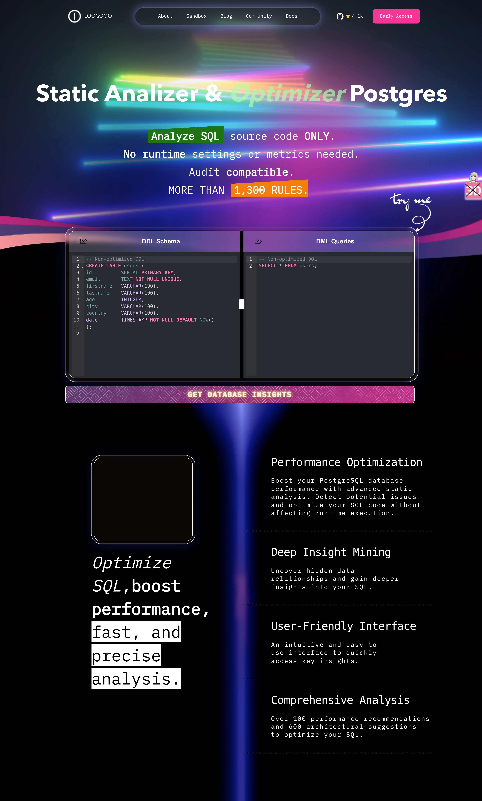

# Full Stack Project - React + Hono (Cloudflare Workers)

This project is structured into two main directories: `web` and `worker`, each serving a specific role in the full stack architecture.



## 📁 Project Structure
```txt
/
├── web/ → Frontend application built with React and TypeScript.
└── worker/ → Backend built with Hono (a framework for Cloudflare Workers) using TypeScript.
```
---

## 📦 `web/` - Frontend

This directory contains the frontend application developed with **React** and **TypeScript**. It handles the user interface and interacts with the backend via HTTP requests.

### Main technologies:
- React
- TypeScript
- Vite
- TailwindCSS

---

## ⚙️ `worker/` - Backend

This directory contains the backend logic developed using **Hono**, a lightweight framework for building APIs on **Cloudflare Workers** with **TypeScript**.

### Main technologies:
- Hono (https://hono.dev/)
- TypeScript
- Cloudflare Workers

## 🛠️ Available Scripts

The project includes several useful scripts defined in `package.json` for development, build, and deployment:

```json
"scripts": {
  "build:web": "vite build --config ./vite.config.ts",
  "dev:web": "pnpx vite --port=4000",
  "dev": "pnpm run build:web && wrangler dev",
  "deploy": "wrangler deploy --minify",
  "cf-typegen": "wrangler types --env-interface CloudflareBindings"
}
```

### Script details:
- `build:web` – Builds the React frontend using Vite.
- `dev:web` – Starts the Vite development server for the frontend on port 4000.
- `dev` – Builds the frontend and starts the Cloudflare Workers development server using Wrangler.
- `deploy` – Deploys the worker to Cloudflare with minification enabled.
- `cf-typegen` – Generates TypeScript types for Cloudflare environment bindings.


## 📂 Requirements
- Node.js
- Wrangler CLI (for developing with Cloudflare Workers)
- pnpm as a package manager

## 📝 Notes

The web frontend communicates with the worker backend via HTTP API endpoints exposed by Hono.
This structure helps keep the architecture clean, modular, and scalable.

